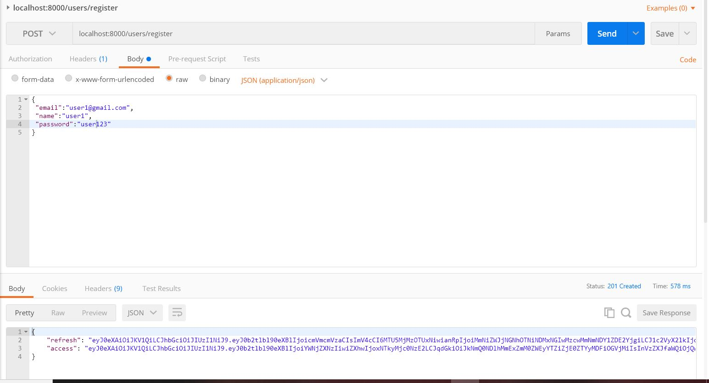

# django-simple-jwt-auth

###### Allow users to register, sign in and sign out with Django REST Framework and simple-JWTs.


Django comes with a session-based authentication system that works out of the box. It includes all of the models, views, and templates you need to let users log in and create a new account. Here's the rub though: Django's authentication only works with the traditional HTML request-response cycle.

What do we mean by "the traditional HTML request-response cycle"? Historically, when a user wanted to perform some action (such as creating a new account), the user would fill out a form in their web browser. When they clicked the "Submit" button, the browser would make a request — which included the data the user had typed into the registration form — to the server, the server would process that request, and it would respond with HTML or redirect the browser to a new page. This is what we mean when we talk about doing a "full page refresh."

Why is knowing that Django's built-in authentication only works with the traditional HTML request-response cycle important? Because the client we're building this API for does not adhere to this cycle. Instead, the client expects the server to return JSON instead of HTML. By returning JSON, we can let the client decide what it should do next instead of letting the server decide. With a JSON request-response cycle, the server receives data, processes it, and returns a response (just like in the HTML request-response cycle), but the response does not control the browser's behavior. It just tells us the result of the request.

Luckily, the team behind Django realized that the trend of web development was moving in this direction. They also knew that some projects might not want to use the built-in models, views, and templates. They may choose to use custom versions instead. To make sure all of the efforts that went into building Django's built-in authentication system wasn't wasted, they decided to make it possible to use the most important parts while maintaining the ability to customize the end result.


### Session-based authentication

By default, Django uses sessions for authentication. Before going further, we should talk about what this means, why it's important, what token-based authentication and JSON Web Tokens (JWTs for short) are.


In Django, sessions are stored as cookies. These sessions, along with some built-in middleware and request objects, ensure that there is a user available on every request. The user can be accessed as request.user. When the user is logged in, request.user is an instance of the User class. When they're logged out, request.user is an instance of the AnonymousUser class. Whether the user is authenticated or not, request.user will always exist.


This authentication scheme uses Django's default session backend for authentication. Session authentication is appropriate for AJAX clients that are running in the same session context as your website.

If successfully authenticated, SessionAuthentication provides the following credentials.

````request.user````  will be a Django User instance.
````request.auth````  will be None.
Unauthenticated responses that are denied permission will result in an ````HTTP 403 Forbidden```` response.

 [Read More](https://www.django-rest-framework.org/api-guide/authentication/#sessionauthentication)


### Token-based authentication

The most common alternative to session-based authentication is token-based authentication, and we will be using a specific form of token-based authentication to secure our application.

With token-based auth, the server provides the client with a token upon a successful login request. This token is unique to the user logging in and is stored in the database along with the user's ID. The client is expected to send the token with future requests so the server can identify the user. The server does this by searching the database table containing all of the tokens that have been created.If a matching token is found, the server goes on to verify that the token is still valid. If no matching token is found, then we say the user is not authenticated.

Because tokens are stored in the database and not in cookies, token-based authentication will suit our needs.


### Verifying tokens

We always have the option of storing more than just the user's ID with their token. We can also store things such as a date on which the token will expire. In this example we would need to make sure that this expiration has not passed. If it has, then the token is not valid. So we delete it from the database and ask the user to log in again.


###### WHAT IS JSON WEB TOKEN?

JSON Web Token (JWT) is an open standard (RFC 7519) that defines a compact and self-contained way for securely transmitting information between parties as a JSON object. This information can be verified and trusted because it is digitally signed. JWTs can be signed using a secret (with HMAC algorithm) or a public/private key pair using RSA.  [Read More](https://auth0.com/learn/json-web-tokens/)

### Simple JWT


A JSON Web Token authentication plugin for the [Django REST Framework](https://www.django-rest-framework.org/)


Simple JWT provides a JSON Web Token authentication backend for the Django REST Framework. It aims to cover the most common use cases of JWTs by offering a conservative set of default features. It also aims to be easily extensible in case a desired feature is not present. More information about [Simple-JWT](https://django-rest-framework-simplejwt.readthedocs.io/en/latest/index.html).


#### Creating the Custom User model


For more details about [Custom User](https://git.generalassemb.ly/jmeade11/instasham#create-a-custom-user)


### Adding simple-JWT Token Authentication

<!-- Start by creating ```` users/serializers.py````  and type the following code -->

 - Simple JWT can be installed with pipenv:

 ```

 pipenv install djangorestframework_simplejwt 

 ```

 Then, your django project must be configured to use the library. In ````settings.py````, add ````rest_framework_simplejwt.authentication.JWTAuthentication````to the list of authentication classes:


```
REST_FRAMEWORK = {
    ...
    'DEFAULT_AUTHENTICATION_CLASSES': (
        ...
        'rest_framework_simplejwt.authentication.JWTAuthentication',
        'rest_framework.authentication.SessionAuthentication',  
    )
    ...
}

```

Create a file called  ````users/urls.py````  and include routes for Simple JWT’s ````TokenObtainPairView```` and ````TokenRefreshView```` views:


```python

from rest_framework_simplejwt.views import (
    TokenObtainPairView,
    TokenRefreshView,
)

urlpatterns = [
    ...
    path('api/token/', TokenObtainPairView.as_view(), name='token_obtain_pair'),
    path('api/token/refresh/', TokenRefreshView.as_view(), name='token_refresh'),
    ...
]

```


### New User Registration 


- Next we’ll need a serializer for the User object Add ````users/serializers.py````. Add the following code.


```python

from rest_framework import serializers
from django.contrib.auth import authenticate
from rest_framework_simplejwt.tokens import RefreshToken
from django.contrib.auth import get_user_model
User = get_user_model()


class UserSerializer(serializers.ModelSerializer):
    password = serializers.CharField(write_only=True)
    email = serializers.CharField(write_only=True)
    name = serializers.CharField(write_only=True)

    class Meta:
        model = User
        fields = ('email', 'name', 'password')

    def create(self, validated_data):

        name = validated_data['name']
        email = validated_data['email']
        password = validated_data['password']
        user = User(email=email, name=name)
        # Sets the user’s password to the given raw string,
        # taking care of the password hashing. Doesn’t save the User object.

        user.set_password(password)

        # save() method to save the user object
        user.save()

        return user
```


By calling the ```get_user_model()``` function. It’s good practice to do it this way instead of importing the User directly, since it will ensure that we get the currently active **User** model even if we have customized it.


We also override the ```create()``` method and we set password by it's given value. ````set_password(raw_password)````
Sets the user’s password to the given raw string, taking care of the password hashing. Doesn’t save the AbstractBaseUser object.

 [Read More](https://docs.djangoproject.com/en/3.0/topics/auth/customizing/)


- Next we’ll add a view in ````users/views.py```` and add the following code:


```python
from .serializers import UserSerializer
from rest_framework import permissions, status
from rest_framework.response import Response
from rest_framework.views import APIView
from rest_framework import status
from rest_framework.permissions import AllowAny, IsAuthenticated
from django.contrib.auth import get_user_model
User = get_user_model()
from rest_framework_simplejwt.tokens import RefreshToken


class RegistrationAPIView(APIView):

    permission_classes = (AllowAny,)
    serializer_class = UserSerializer

    def post(self, request):
        serializer = UserSerializer(data=request.data)
        if serializer.is_valid():
            user = serializer.save()
            # This method will return the serialized representations of new refresh
            #  and access tokens for the given user.
            refresh = RefreshToken.for_user(user)
            res = {
                "refresh": str(refresh),
                "access": str(refresh.access_token),
            }
            return Response(res, status=status.HTTP_201_CREATED)
            return Response(serializer.errors, status=status.HTTP_400_BAD_REQUEST)


```


This method checks, if the serializer has validated the data we got, and if not return it’s error object. If everything is fine it saves the serializer, which returns the newly created user object. We can then obtain a JWT token for this user and return it.


Read  more about  [Creating tokens manually .](https://django-rest-framework-simplejwt.readthedocs.io/en/latest/creating_tokens_manually.html)


Read more about [Requests and Responses](https://www.django-rest-framework.org/tutorial/2-requests-and-responses/) in **django-rest-framework**.


- Next, add following code in ```users/urls.py```


```python

from django.urls import path, include
from rest_framework_simplejwt.views import (
    TokenObtainPairView,
    TokenRefreshView,
)
from .views import RegistrationAPIView   #<--- new line
from . import views     # <--- new line


urlpatterns = [
    path('users/register', RegistrationAPIView.as_view()), # <--- new


    path('api/token/', TokenObtainPairView.as_view(), name='token_obtain_pair'),
    path('api/token/refresh/', TokenRefreshView.as_view(), name='token_refresh'),
]


```
And that’s it. We should now have a new endpoint at ```http://localhost:8000/users/register```


We can test it in Postman: 




 If the validations pass it should return an object with refresh and access tokens.


 And that’s it! You now have a fully functional registration endpointAPI that can be consumed by a client from anywhere.